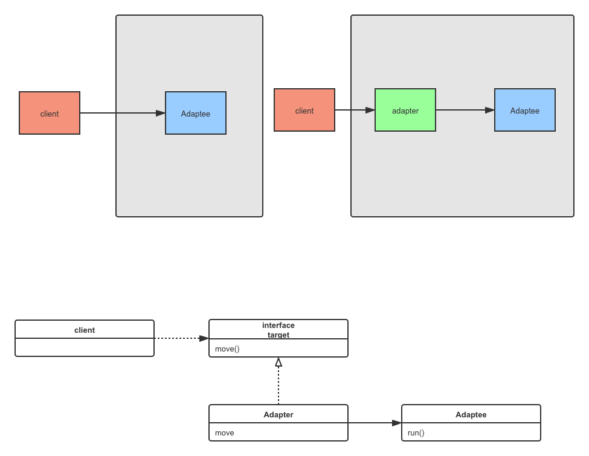

[TOC]

## 1. 设计模式的三大类型
### 1.1. 创建型模式
创建型模式对类的实例化过程进行了抽象，能够将软件模块中**对象的创建**和**对象的使用**分离。  
为了是软件结构更加清晰，外接对于这些对象只需要知道他们**共同的接口**，而不需要知道其中的具体的实现细节，使得整个系统的设计更加符合**单一职责**的原则。

### 1.2. 结构型模式
结构型模式描述如何将**类和对象**结合在一起形成更大的结构，通过简单的**组合**形成复杂的，功能更为强大的结构。

分为**类结构型模式**和**对象结构型模式**

- **类结构型**：关心类的组合，由多个类组成更大的系统，一般只存在**继承和实现**关系
- **对象结构型**：通过关联关系使得**一个类**中定义另一个类的**实例**，然后通过实例调用其方法。

根据**合成复用**原则，在系统中尽量**使用关联关系来替代继承关系**，因此大多数结构型都是对象结构型。

#### 1.2.1. 外观（facade）模式
对象结构型设计模式，利用关联关系将类的实例组合在一起  
概念：提供了一个统一的接口，用来访问子系统中的一群接口。外观模式定义了一个高层接口，让子系统更容易使用。

如上图，正常情况下我们的client如果单独调用各个子系统，那么之间的耦合度随着子系统的增多而增加，那么子系统越多，更改的可能性就越大，这样每次子系统有改变，都有可能造成client代码的修改，违背了“开闭原则”  
如果增加一个facade类，client通过facade类调用子系统的一群接口，这样client与faced之间只有一条关联关系，这样耦合度就降低了。  

问题：那facade与system之间依然是强耦合啊？  
单纯一个client使用这个facade类体现不出外观模式的优势，但是试想如果有多个client，如果不使用外观模式，system已修改，那么所有的client都需要的修改，外观模式则只需要修改，system和facade类即可。  
_图中的关联关系可以大致看出系统的耦合度，client关联的越多，系统越脆弱_

外观模式是`最少知道原则`的经典体现  
最少知道原则：只和你的密友交谈  
如果遵从最少知道原则呢？ 
就任何对象而言，再该对象的方法内，我们应当只调用属于以下范畴的方法 
- 该对象本身
- 被当做方法的参数儿传递进来的对象
- 此方法所创建货实例化的对象
- 对象的任何组件

总之一句话，不能跨级调用方法，保持在一定的界限内，就容易控制。不光是代码，中国古代社会也有阶级，权贵为了好控制，就把人限制在当前阶级，社会就好控制。

#### 1.2.2. 适配器模式
概念：将类的接口转换成客户期望的另一个接口。  
简而言之：转换接口，对象结构型模式  
遵从开闭原则，多用组合原则，面向接口编程
  
如上图，这样无论增加多少个适配者类，client类都只需要面向Target接口编程即可，满足了开闭原则。

**适配器 vs 外观模式**  
意图不同  
- 适配器是转化接口
- 外观模式是简化调用

问题：适配器只能一个适配类关联一个适配者类，外观是包装多个子系统？  
错，适配器可以是多个适配者类，只要满足adapter的接口即可，adapter就可以传入不同的adaptee类实例。外观也不是必须是多个子系统，可以是一个子系统提供简化的调用方式

综上可以看出：  
外观和适配器，都是通过关联关系将client与另一个系统松耦，以此来达到代码的灵活度。  
这也是行为型模式的本质，通过关联关系来松耦合，符合开闭原则，最少知道原则，面向接口编程。  

缺点：外观和适配者 都不会去 限制client类对子系统的单独调用，也就是说子系统对外是暴露的，这样虽然会很灵活，但是也提高了耦合度，需要我们自己把握，就像闭包，是把双刃剑~

#### 1.2.3. 装饰器模式
#### 1.2.4. 代理模式
#### 1.2.5. 其他...

### 1.3. 行为型模式
是在不同对象之间**划分责任和算法**的抽象化  
不仅关注类和对象的结构，而且重点关注他们之间的**相互作用**

分为类行为型和对象行为型
- **类行为型**：使用**继承**在几个类之间分配行为，主要**通过多态等方式来分配父类与子类的职责** 

- ****对象行为型**：使用对象的****聚合关联**关系来分配行为

根据**合成复用原则**，系统中要**尽量使用关联关系来取代继承关系**，因此大部分行为型设计模式都属于**对象行为型设计模式**

